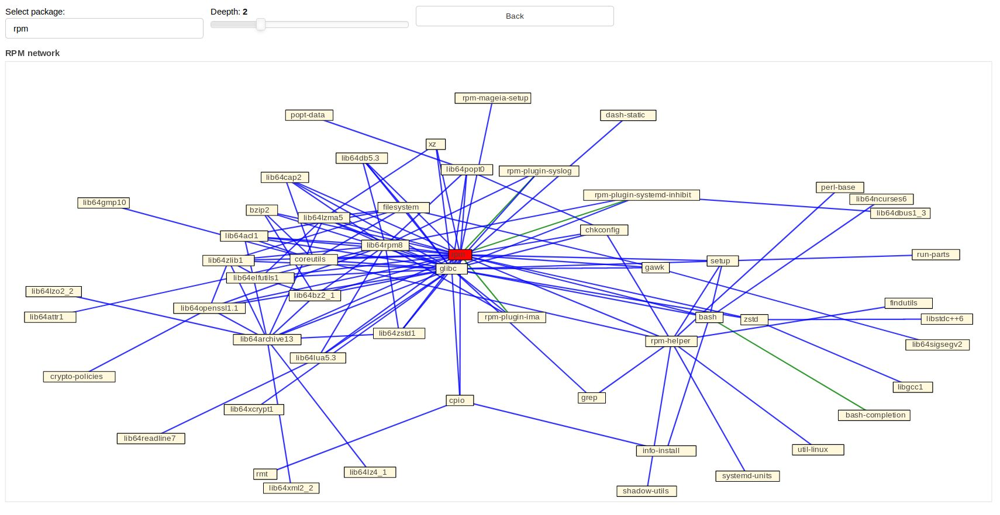

# rpmdep-webgraph
# Cerisier
This tools is intended to render a graphical representation of dependencies of a set of packages of a distribution usinf DNF Api.

You can enter the name of package as the root of the graph. You also click on one of the tags to set the package as the new root.
The slider allows to set the depth of the relations.
Tooltips display information about the package.

need to add bokeh through `pip3 install bokeh`

Launch with `./cerisier` in the root directory.

